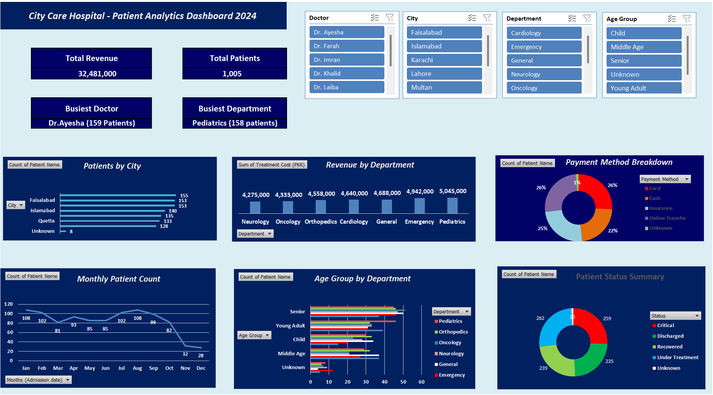
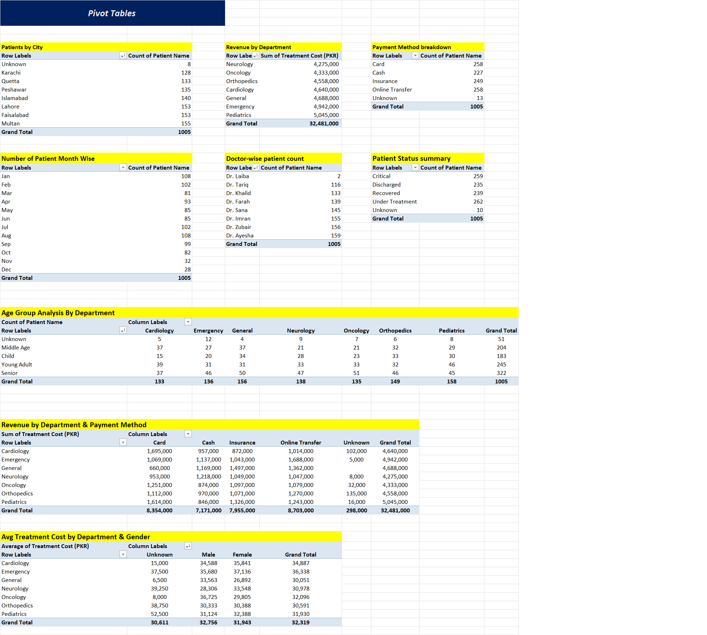
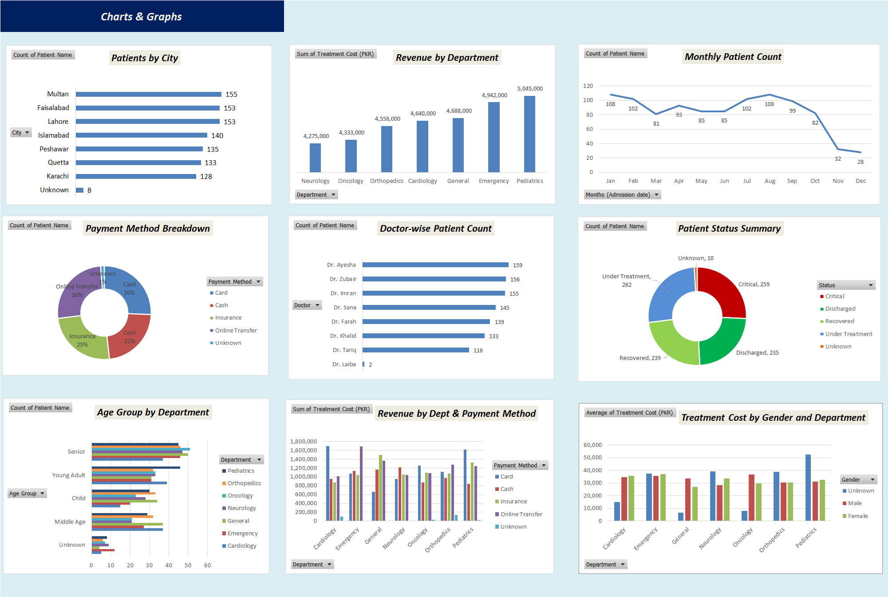

# 📊 City Care Hospital Data Analysis

## 📌 Project Overview
This project analyzes hospital patient data to extract meaningful insights about patient distribution, revenue generation, and treatment trends.

The dataset contains **1023 records** and simulates real-world messy data, including missing values, inconsistent formats, and typographical errors.

---

## 🛠 Tools Used
- Microsoft Excel  
  - Data Cleaning  
  - Pivot Tables  
  - Data Visualization  
  - Dashboard Creation  

---

## 🔍 Data Cleaning Process
The raw dataset contained:
- Inconsistent date formats  
- Missing values  
- Typographical errors (e.g., city names)  

Steps performed:
- Standardized date formats  
- Cleaned and corrected text fields  
- Structured data into a proper table format  

---

## 📈 Data Analysis
Performed analysis using Pivot Tables:
- Patient distribution by city  
- Revenue by department  
- Payment method analysis  

---

## 📊 Dashboard
An interactive dashboard was created to visualize:
- Total patients  
- Revenue trends  
- Department performance  

---

## 📸 Screenshots

### Dashboard

### Pivot Table

### Charts

---

## 💡 Key Insights
- Major cities contribute the highest number of patients  
- Certain departments generate significantly more revenue  
- Insurance is a commonly used payment method  

---

## 🚀 Conclusion
This project demonstrates practical skills in:
- Data cleaning  
- Data analysis  
- Data visualization  

using Microsoft Excel in a real-world scenario.
